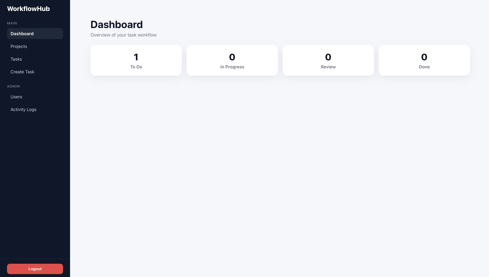
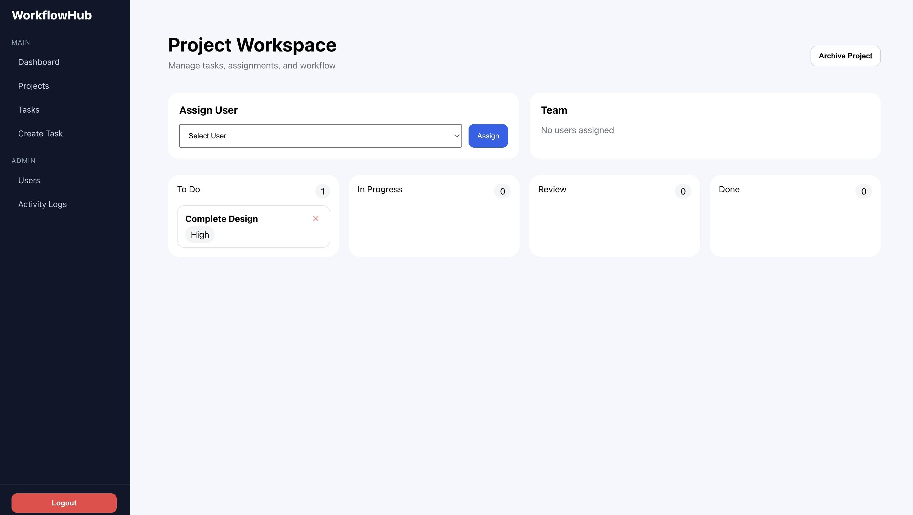

# WorkflowHub

A full-stack SaaS-style workflow and project management platform for managing projects, tasks, and users with role-based access control.

Built with React and ASP.NET Core, WorkflowHub simulates a production-grade workflow system with authentication, activity logging, and scalable backend architecture.

---

## Live Demo

[View App](https://puffwya.github.io/WorkflowHub/#/login)

---

## Preview

---

## Core Features

- Project and task management system
- Kanban-style workflow tracking
- Role-based access control (Admin / Manager / Employee)
- JWT authentication and protected routes
- Activity logging and audit tracking
- User and permission management
- Real-time task filtering and updates

---

## Architecture Overview

### Frontend
- React (Hooks + Functional Components)
- React Router
- Axios with JWT interceptors
- Role-based UI rendering

### Backend
- ASP.NET Core Web API
- Clean layered architecture (Controller → Service → Repository)
- Entity Framework Core
- PostgreSQL database
- JWT authentication & authorization
- Dockerized deployment support

---

## System Design Highlights

- Secure authentication with JWT
- Role-based permission system
- RESTful API design
- Audit logging for system actions
- Modular service architecture
- Separation of frontend/backend concerns

---

## Key Roles

**Admin**
- Full system access
- User and role management
- Global project/task control

**Manager**
- Project creation and management
- Task assignment and tracking
- Team coordination

**Employee**
- View assigned work
- Update task status
- Limited system access

---

## Tech Stack

`React` `ASP.NET Core` `Entity Framework Core` `PostgreSQL` `JWT` `Docker`

---

## Notes

This project helped me understand production-style full-stack engineering concepts including authentication systems, role-based access control, scalable API architecture, and modern SaaS UI patterns.
